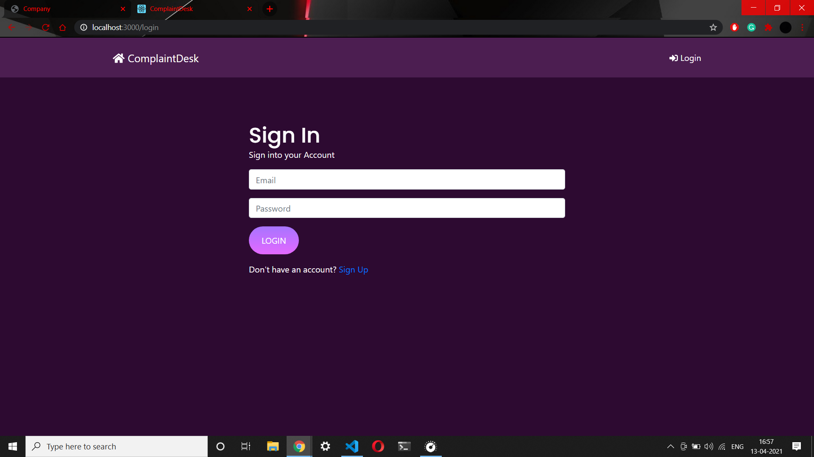
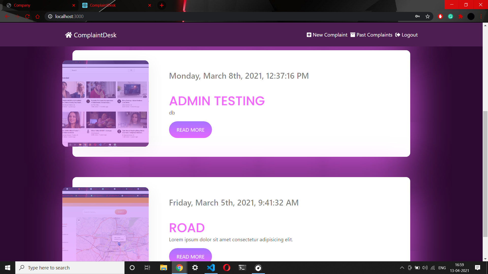
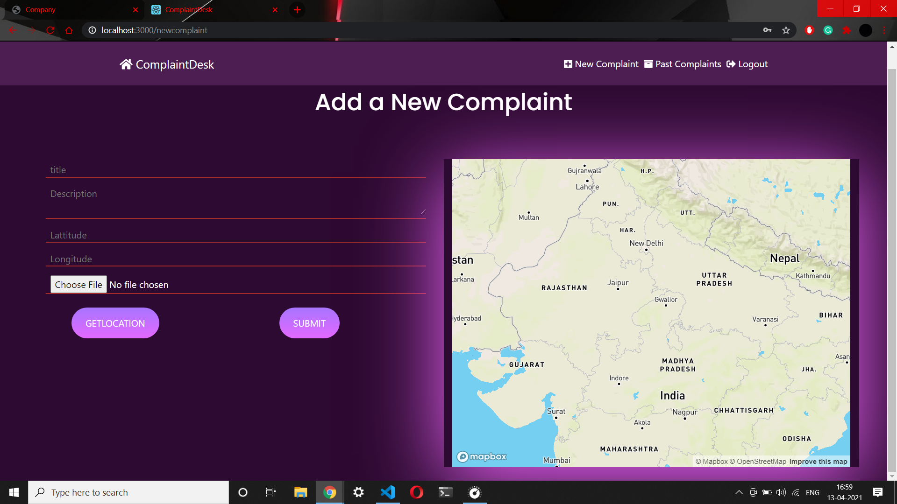
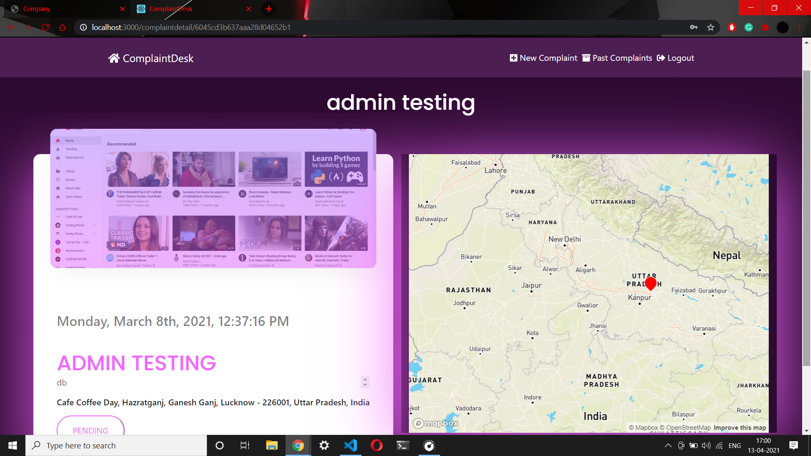
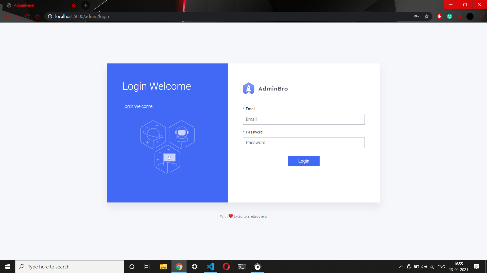
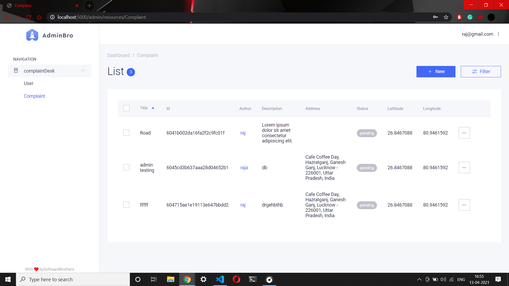

# ComplaintDesk

---
ComplaintDesk is a MERN stack based platfrom where people can register complaints regarding the problem they face, and the gov-employees on the other side can check that complaint and mark the complaint solved/pending according to its status.

---

# Features
    -user can login/signup. 
    -Complaint author can Add/Update/Delete their complaints.
    -User can check the list of their past complaints.
    -user can filter the complanits according to area/topic.
    -User has option to tag complaint with its location.
    -Location can be added via map (used mapbox for this) or by loading user's live location.
    -Admin Panel, where only admins can log in. and can mark complaint solved/pending.
    -Admin can filter complaints by area/complaint title.
    -Admin has the option to add another admins.
    -website is completely responsive.

### Screenshots

-Registration Page

---

-Login Page

---

-Home Page

---
-Add Complaint Page

---

-Complaint Detail Page

---

-Admin Login Page

---

-Admin Panel Page

---

### Tech Stack
    -MERN

